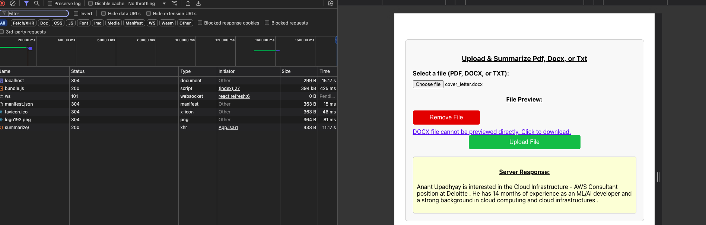

# Summarizer

This repository contains a full-stack application designed to summarize documents using powerful language models. The backend is built with Python, and the frontend is implemented using React.

 
## Features

- **Document Upload**: Users can upload files (PDF, DOCX, TXT) directly through the frontend.
- **File Preview**: Once a document is uploaded, a preview is displayed.
- **Document Summarization**: The uploaded document is summarized using one of two available services.

## Backend Overview

The backend is implemented using Python and offers two main services for summarization:

1. **`main.py`**:  
   - Utilizes the GPT-2 language model for summarization.
   - Provides high-quality summaries but is relatively slow and time-consuming.

2. **`main2.py`**:  
   - Leverages the Transformers library's dedicated summarization model.
   - Offers a faster and more efficient summarization process.

## Frontend Overview

The frontend is developed using React and provides a simple user interface:

- **Upload Button**: Users can upload a document through a straightforward UI.
- **Preview and Summary Display**: After uploading, the document is previewed, and the generated summary is displayed.

## How to Run

1. **Clone the repository**:
   ```bash
   git clone https://github.com/AnantUpadhyay02/Summarizer.git
   cd Summarizer
